# Deep Learning Trading Bot

This repository serves as a public showcase for a private high-frequency algorithmic trading project. The system utilizes deep reinforcement learning (RL) to make autonomous trading decisions in cryptocurrency markets.

## Project Overview

The goal of this project is to create a robust trading agent that adapts to changing market conditions without relying on hard-coded strategies. The agent learns to maximize risk-adjusted returns through extensive simulation and training.

### Core Technology

*   **Deep Learning Architecture**: The system leverages state-of-the-art sequence modeling techniques to identify complex temporal patterns and relationships within the data.
*   **Multi-Modal Data Pipeline**: The bot ingests a high-dimensional feature set to form its view of the market, combining:
    *   **Market Data**: High-frequency price and volume information.
    *   **Network Activity**: Metrics reflecting on-chain behavior and adoption.
    *   **Sentiment Analysis**: Signals derived from social media and news trends.
    *   **Macro Indicators**: Broader economic signals to detect long-term market regimes.
*   **Fidelity-First Backtesting**: To avoid the common pitfall of look-ahead bias, the backtesting engine strictly enforces real-world constraints, accounting for data latency, trading fees, and slippage.

## Performance & Visualizations

The following plots are generated from backtests on unseen data. Each window represents a specific period where the model's decisions were simulated against historical data.

### Backtest Results

These charts show the equity curve, drawdown, and key performance metrics for various testing windows.

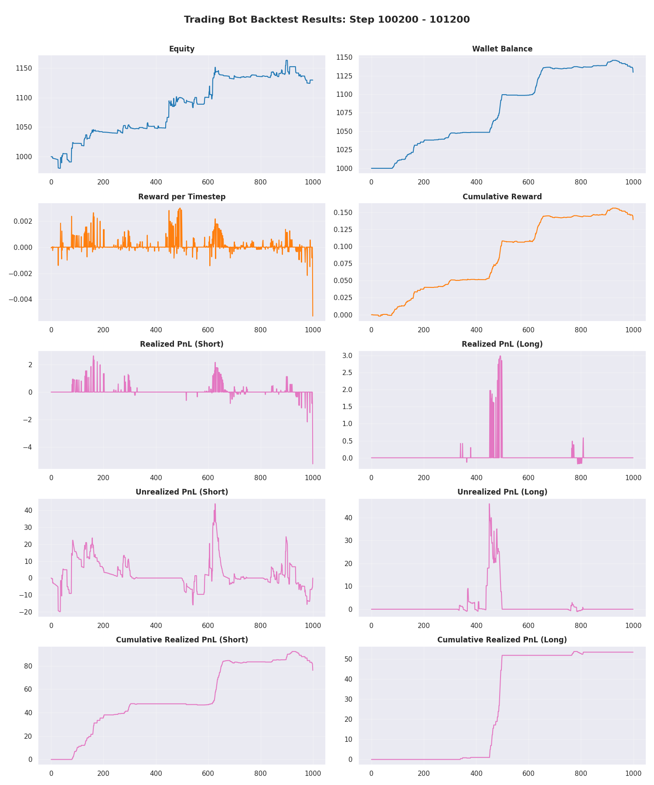
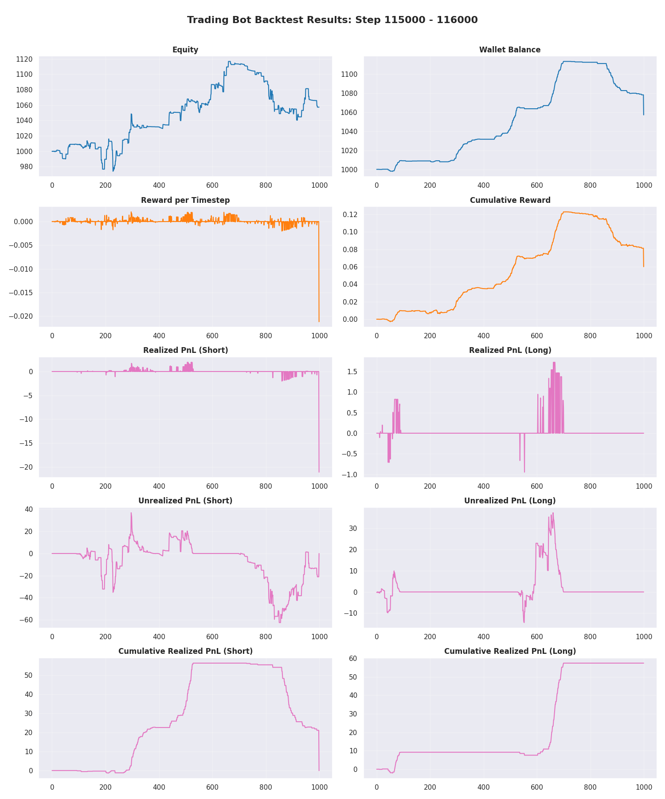
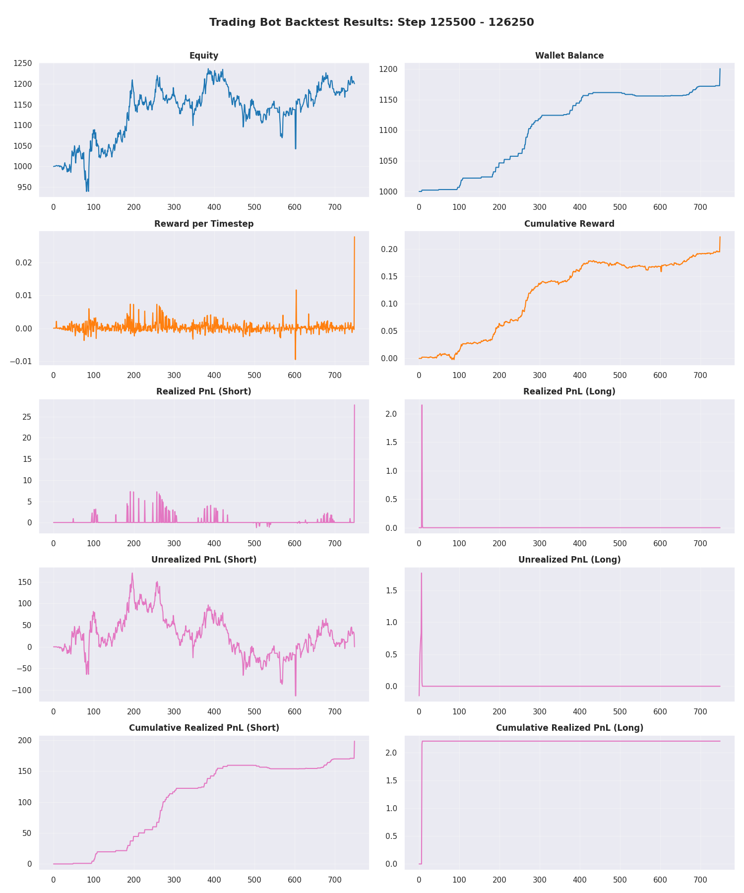
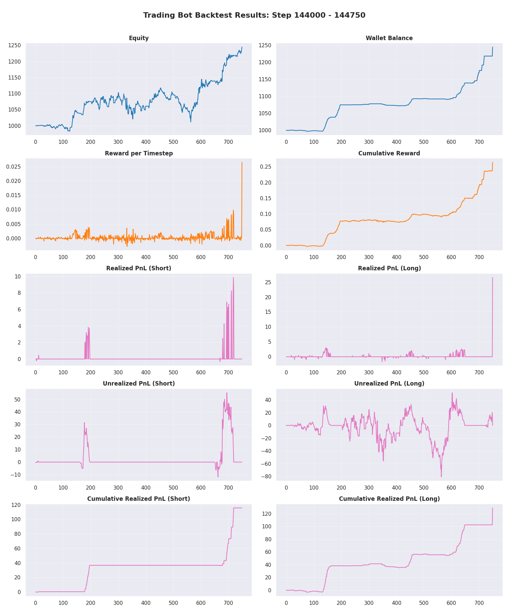
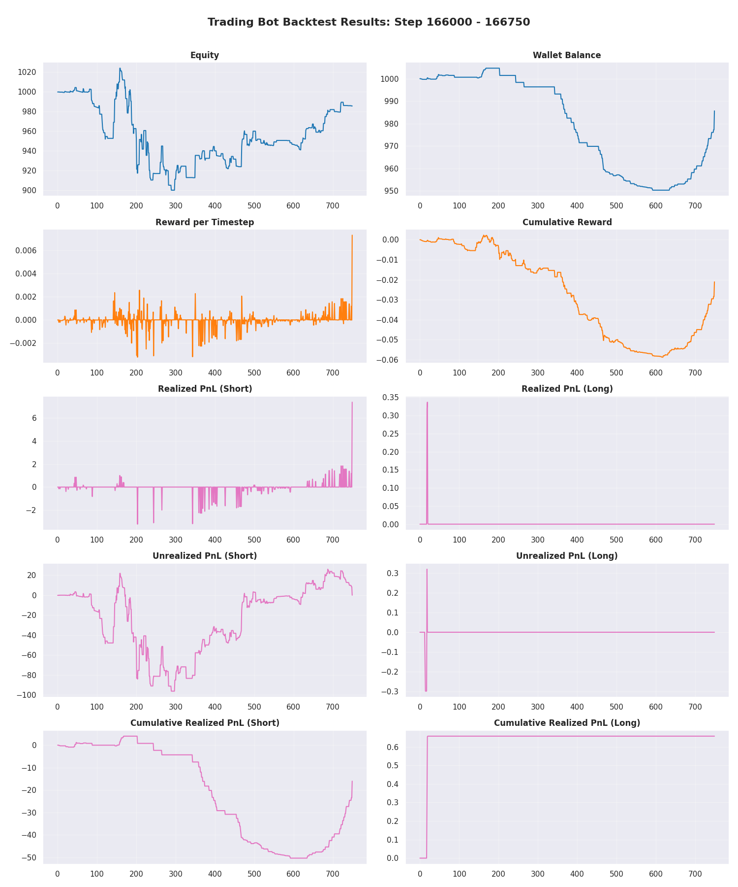
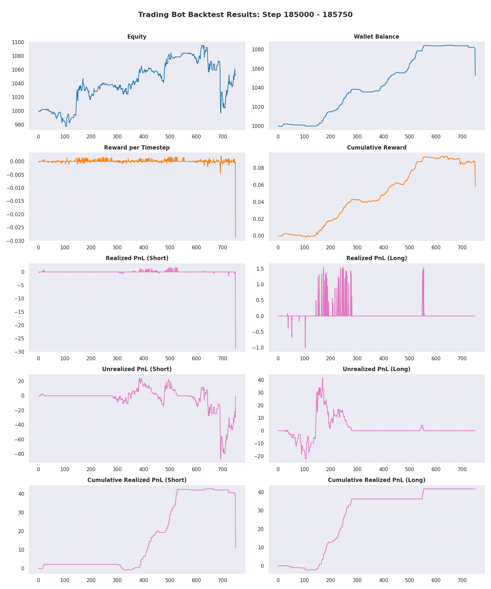
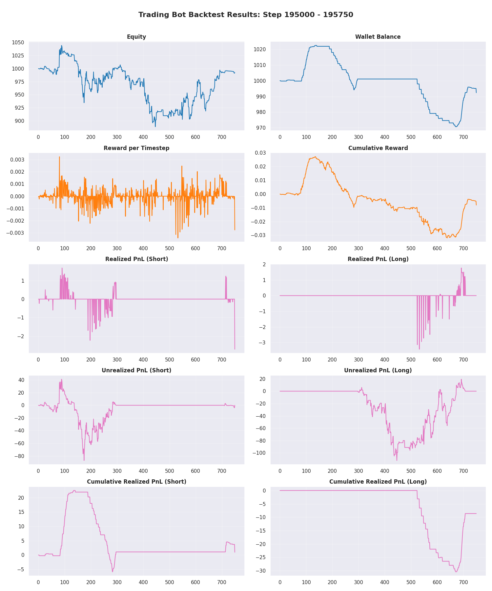
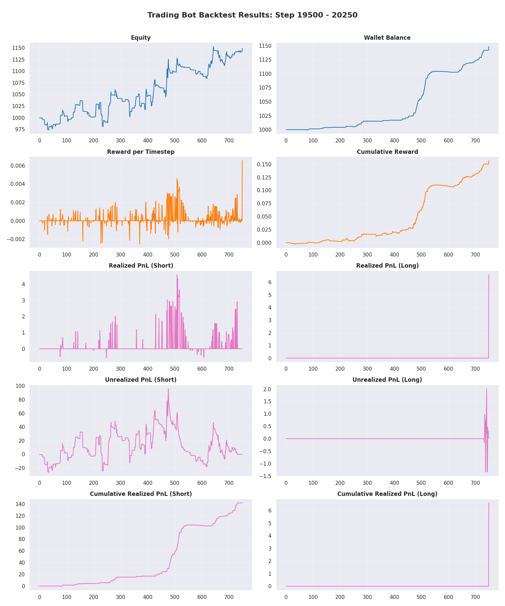
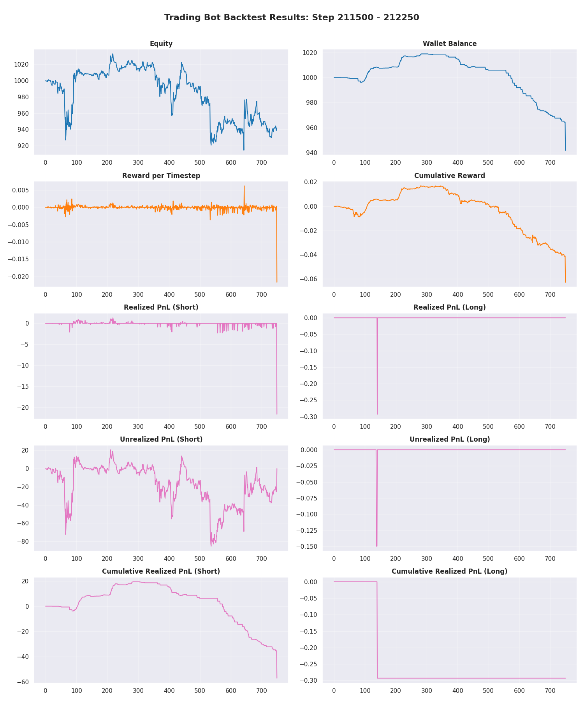
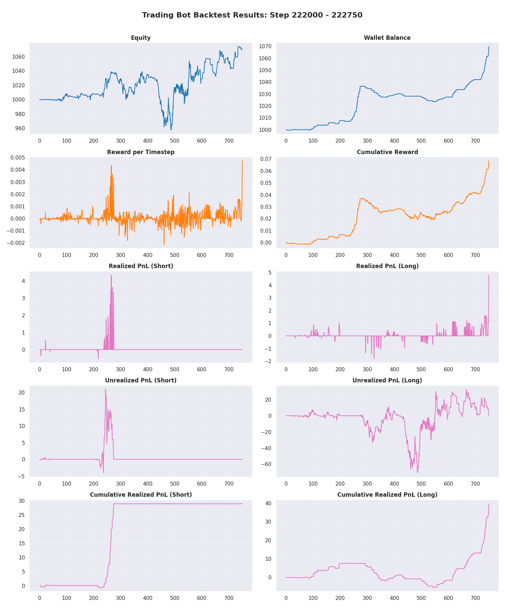
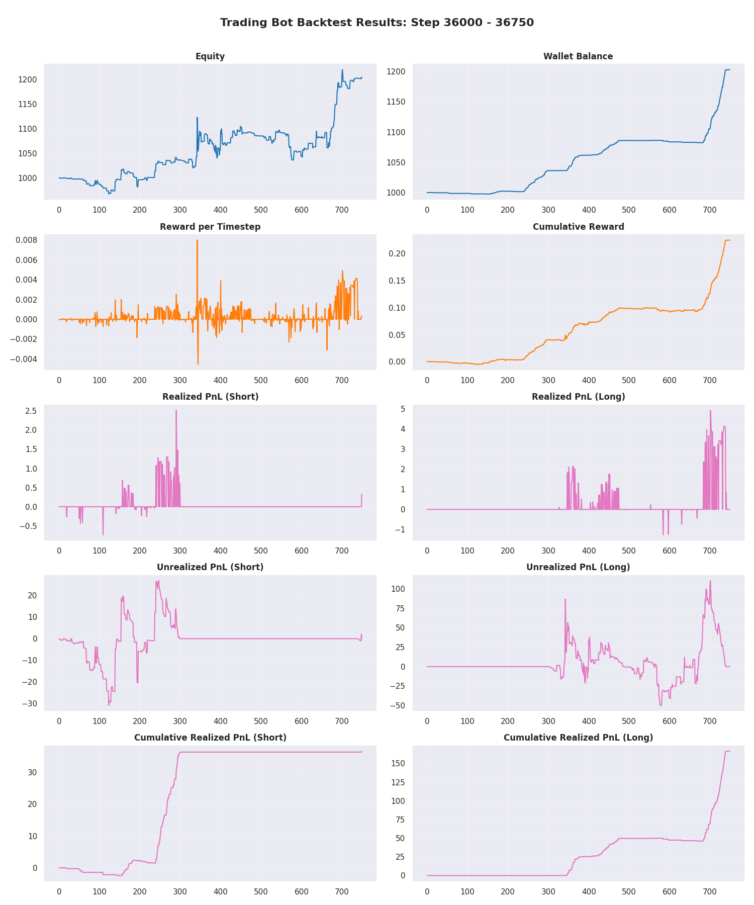

### Trade Visualizations

Visualizing specific trade entries and exits helps verify that the model is reacting to valid signals rather than noise.

#### Long Positions

#### Short Positions

### Dataset Overview

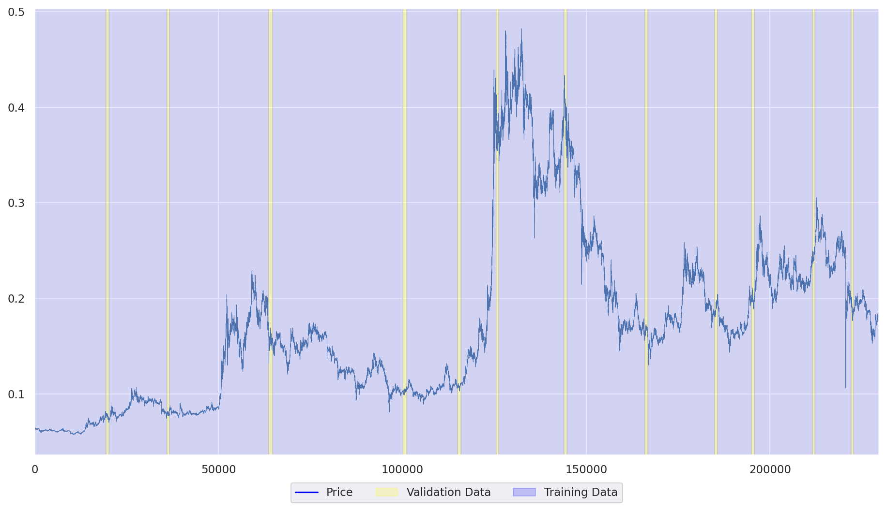
